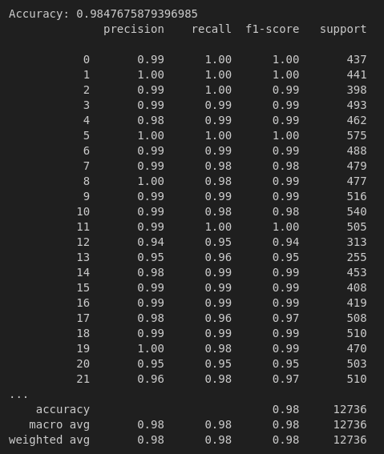

# 🧠 SignSpeak: Real-Time ASL to Speech Translator

A real-time web application that uses your webcam and a machine learning model to recognize American Sign Language (ASL) **alphabet signs** and convert them into **text and speech**. Built with **Flask**, **OpenCV**, **MediaPipe**, and **gTTS**, with a clean and responsive **HTML/CSS/JS frontend**.

---

## ✨ Features

- 📷 Real-time webcam-based hand detection using MediaPipe
- 🔠 Recognizes static ASL signs for 26 letters + "space", "nothing", and "del"
- 🧠 ML model (trained on 63 MediaPipe landmark features)
- ✍️ Constructs full sentences from signs in sequence
- 🗣️ Converts constructed sentence into speech using Google Text-to-Speech
- 🎨 Modern, responsive UI (built from scratch with HTML and CSS)

---

## 📂 Folder Structure

```
project/
├── app.py                    # Main Flask backend
├── requirements.txt          # Python dependencies
├── model/
│   ├── asl_model.joblib      # ML model (auto-downloaded)
│   └── label_encoder.joblib  # Label encoder (auto-downloaded)
├── static/
│   └── audio/                # Contains generated .mp3 files
├── templates/
│   └── index.html            # Frontend web page
```

---

## 🧠 How It Works

1. OpenCV captures video from the webcam.
2. MediaPipe extracts 21 hand landmarks (x, y, z = 63 features).
3. The trained RandomForestClassifier model predicts the ASL letter.
4. A letter is only added to the sentence if:
   - It's stable across multiple frames, and
   - The model's confidence is **85% or more**.
5. User can press:
   - ✅ **Speak** → converts the sentence to an audio file
   - ❌ **Clear** → resets the current sentence
6. Audio is saved and streamed via browser.

---

## 🚀 Getting Started

### 1. Clone the Repository

```bash
git clone https://github.com/your-username/signspeak.git
cd signspeak
```

### 2. Install Python Requirements

```bash
pip install -r requirements.txt
```

### 3. Run the Application

```bash
python app.py
```

Visit [http://localhost:5000](http://localhost:5000) in your browser.

---

## 🧠 Model Details

The model used is a traditional machine learning classifier trained on 63 features extracted from MediaPipe's 21 hand landmarks (x, y, z per point). The model is trained on over 60,000 examples spanning:

- 26 alphabets (A-Z)
- Space
- Nothing (idle hand / background)
- Del (delete character)

### 🎯 Accuracy Achieved

- Overall Accuracy: **98.47%**
- Macro Avg F1-Score: **0.98**

| Classification Report Sample |
|------------------------------|
|  |

The model is saved as `asl_model.joblib` with a `label_encoder.joblib`. Both are downloaded automatically via `gdown` on first app run.

---

## 📦 Model Files

The model (`asl_model.joblib`) and encoder (`label_encoder.joblib`) will be automatically downloaded from Google Drive on first run.

> This prevents bloating the repository with large binary files.

You can manually replace the model inside the `model/` folder later.

---

## 📦 Requirements

- `Flask`
- `opencv-python`
- `mediapipe`
- `numpy`
- `joblib`
- `gdown`
- `gTTS`

Install with:

```bash
pip install -r requirements.txt
```

---

## 🛠️ Future Improvements

- [ ] Add word-level or phrase-based prediction using 3D CNNs
- [ ] Support dynamic signs with LSTM or Transformers
- [ ] Add language model integration (T5, GPT) to clean sentences
- [ ] Deploy as a public demo on Render or Hugging Face Spaces

---

## 📄 License

This project is licensed under the **MIT License**. You are free to use, share, and modify it with attribution.

---

## 👤 Author

**Somya Soneji**  
Built with ❤️ to bridge communication between the Deaf and hearing world.

> Feel free to fork, star ⭐, and share it with others!
